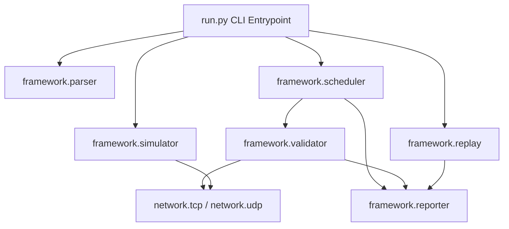

<div align="center">

# 📶 QualTest v1.0.0

**Wireless Modem Validation & Test Automation Framework**

[](https://www.python.org/downloads/)
[](https://github.com/Sarath-Patti/QualTest/actions)
[](LICENSE)
[](https://github.com/psf/black)
[](https://github.com/astral-sh/ruff)
[](http://mypy-lang.org/)
[](https://docs.pytest.org/)

*A modular, high-performance Python framework for validating wireless modem hardware, cellular baseband firmware, and 3GPP LTE/5G NR protocol stack implementations.*

</div>

---

## 📌 Project Overview

QualTest is an enterprise-grade test automation and protocol analysis framework built to simulate cellular modem communications, validate AT/NAS/RRC signaling procedures, execute concurrent regression test suites, inject real-world wireless link impairments, and reconstruct modem state transitions via offline signaling log replay.

---

## ✨ Key Features

- ⚡ **Multi-Protocol Modem Simulator**: Embedded TCP and UDP network servers for emulating modem hardware response logic.
- 🧵 **Concurrent Test Scheduler**: Parallel testcase execution engine powered by `ThreadPoolExecutor` worker pools.
- ⏱️ **Microsecond Latency Tracking**: Precise command-response timing measurements using high-resolution performance counters.
- 💥 **Failure Injection Engine**: Configurable impairment simulator (packet drop, timeout, disconnect, malformed payload, delay).
- 📜 **Offline Protocol Replay Engine**: Replays 3GPP LTE/5G NR signaling logs (JSON, CSV, Plain Text) without live sockets.
- 🔄 **Modem Finite State Machine (`ModemFSM`)**: State reconstruction across `IDLE`, `RRC_CONNECTING`, `CONNECTED`, `REGISTERED`, `IN_SERVICE`, `HANDOVER`, `DETACHED`, and `ERROR` states.
- 📊 **Automated Report Generation**: Executive HTML dashboard (`reports/report.html`) and structured CSV exports (`reports/report.csv`).
- 🛡️ **Engineering Quality**: 100% compliant with Black, Ruff, MyPy static typing, and Pytest coverage standards.

---

## 📡 Supported Protocols & Signaling

| Protocol Layer | Supported Signaling Messages |
| :--- | :--- |
| **RRC** | `RRC_CONNECTION_REQUEST`, `RRC_CONNECTION_SETUP`, `RRC_CONNECTION_SETUP_COMPLETE` |
| **NAS** | `NAS_ATTACH_REQUEST`, `NAS_ATTACH_ACCEPT`, `NAS_AUTH_REQUEST`, `NAS_AUTH_ACCEPT` |
| **MOBILITY** | `SERVICE_REQUEST`, `SERVICE_ACCEPT`, `HANDOVER_REQUEST`, `HANDOVER_COMPLETE` |
| **DETACH** | `DETACH_REQUEST`, `DETACH_ACCEPT` |

---

## 🏗️ Architecture Overview



Refer to [docs/architecture.md](docs/architecture.md) for full subsystem specifications.

---

## 📂 Directory Structure

```
QualTest/
├── framework/                 # Core Framework Subsystems
│   ├── config/                # Centralized Settings & Env Config
│   ├── logger/                # Logging Subsystem
│   ├── parser/                # JSON Testcase Loader & Validator
│   ├── simulator/             # Network Simulator Manager & Failure Injector
│   ├── validator/             # Execution Validation Engine & Latency Metrics
│   ├── scheduler/             # ThreadPool Concurrent Scheduler
│   ├── replay/                # Protocol Log Replay, FSM & Signaling Analyzer
│   └── reporter/              # HTML/CSV Report Generator Engine
├── network/                   # Protocol Socket Servers & Clients
│   ├── tcp/                   # TCP Server & Client Implementation
│   └── udp/                   # UDP Server & Client Implementation
├── testcases/                 # JSON Testcase Suites
│   └── examples/              # Sample Testcases (Attach, Detach, Handover)
├── logs/                      # Application Logs & Protocol Samples
│   └── samples/               # Realistic 3GPP Signaling Logs
├── reports/                   # Generated HTML & CSV Test Reports
├── docs/                      # Subsystem & Architecture Documentation
├── tests/                     # Automated Pytest Test Suite
├── pyproject.toml             # Centralized Tooling Configuration
├── run.py                     # Primary CLI Entrypoint
└── VERSION                    # Release Version File (1.0.0)
```

---

## 🚀 Installation & Quick Start

### Prerequisites
- Python 3.10 or higher
- Git

```bash
# Clone repository
git clone https://github.com/Sarath-Patti/QualTest.git
cd QualTest

# Set up virtual environment
python3 -m venv .venv
source .venv/bin/activate

# Install dependencies
pip install -r requirements.txt -r requirements-dev.txt

# Run quality checks & unit tests
ruff check .
black --check .
mypy framework network run.py
pytest
```

---

## 💻 CLI Usage & Examples

### 1. Concurrent Test Execution & Reporting
Execute all testcases in parallel and generate HTML/CSV reports:
```bash
python run.py --run-all testcases/ --report
```

### 2. Single Testcase Execution
```bash
python run.py --run testcases/examples/lte_attach.json --report
```

### 3. Offline Protocol Log Replay (v0.9+)
Replay an LTE attach signaling log offline and inspect state transitions:
```bash
python run.py --replay logs/samples/attach_success.json
```

### 4. Network Simulator with Failure Injection
Start embedded TCP modem simulator with simulated network impairments:
```bash
python run.py --simulator tcp --failure-config config/failure.json
```

---

## 📋 Sample Testcase JSON

```json
{
  "name": "LTE_Attach_Procedure",
  "description": "Validates 3GPP LTE network attach sequence",
  "protocol": "TCP",
  "host": "127.0.0.1",
  "port": 8080,
  "timeout": 5.0,
  "retry": 1,
  "steps": [
    { "send": "RRC_CONNECTION_REQUEST", "expect": "RRC_CONNECTION_SETUP", "delay": 0.05 },
    { "send": "NAS_ATTACH_REQUEST", "expect": "NAS_ATTACH_ACCEPT", "delay": 0.05 }
  ]
}
```

---

## 🖼️ User Interface Screenshots

| HTML Report Summary Dashboard | Offline Protocol Replay CLI Output |
| :---: | :---: |
| *(Placeholder: HTML Execution Summary Dashboard)* | *(Placeholder: CLI Protocol Timeline & Anomaly Report)* |

---

## 🛠️ Engineering Quality & CI/CD

QualTest enforces mandatory quality gates on every commit via GitHub Actions (`.github/workflows/ci.yml`):
- **Black**: Code formatting compliance (`black --check .`).
- **Ruff**: Fast Python linter & import sorter (`ruff check .`).
- **MyPy**: Static type safety check (`mypy framework network run.py`).
- **Pytest**: Unit testing & code coverage (`pytest --cov=framework --cov=network`).

---

## 🗺️ Roadmap & Future Enhancements

- [x] **v0.1 - v0.8**: Foundation, Parser, Simulator, Validator, Failure Injector, Scheduler, Reporter, Engineering Quality.
- [x] **v0.9**: Protocol Log Replay Engine, Modem FSM, Anomaly Detection Analyzer.
- [x] **v1.0**: Production Release, Architecture Specs, Community Docs, Example Suites.
- [ ] **v1.1 (Planned)**: 5G NR Standalone (SA) NAS/RRC message expansions & Wireshark PCAP export.

---

## 📄 License

Distributed under the **MIT License**. See `LICENSE` for details.
