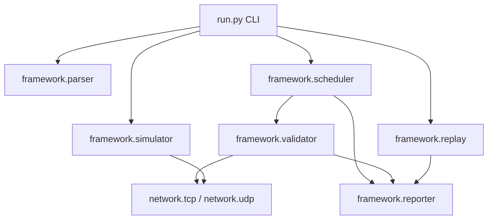
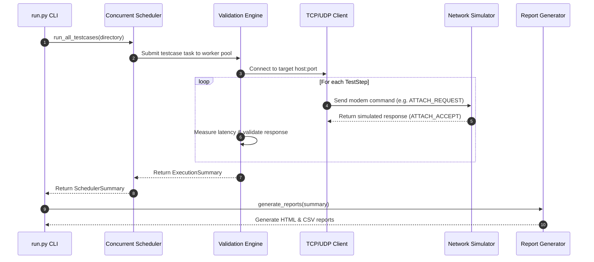

# QualTest Architecture Specification

This document provides a comprehensive overview of the **QualTest** (Wireless Modem Validation & Test Automation Framework) system architecture, component interactions, data flow, and design patterns.

---

## High-Level System Architecture

```
+------------------------------------------------------------------------+
|                               QualTest CLI                             |
|                                 (run.py)                               |
+------------------------------------------------------------------------+
       |                  |                  |                  |
       v                  v                  v                  v
+--------------+   +--------------+   +--------------+   +--------------+
| JSON Parser  |   | Concurrent   |   | Network      |   | Protocol     |
| Subsystem    |   | Scheduler    |   | Simulator    |   | Replay Engine|
+--------------+   +--------------+   +--------------+   +--------------+
       |                  |                  |                  |
       v                  v                  v                  v
+--------------+   +--------------+   +--------------+   +--------------+
| TestCase     |   | Validation   |   | Failure      |   | Modem FSM &  |
| Data Models  |   | Engine       |   | Injector     |   | Analyzer     |
+--------------+   +--------------+   +--------------+   +--------------+
                          |                                     |
                          +------------------+------------------+
                                             |
                                             v
                                  +----------------------+
                                  | Report Generator     |
                                  | (HTML & CSV Reports) |
                                  +----------------------+
```

---

## Subsystem Architecture & Responsibilities

### 1. Configuration & Logging (`framework/config`, `framework/logger`)
- **Settings Singleton (`Settings`)**: Immutable dataclass loading environment parameters (`QUALTEST_LOG_LEVEL`, `QUALTEST_BASE_DIR`, etc.).
- **Logger Subsystem (`setup_logger`)**: Thread-safe rotating file and stream logging system.

### 2. JSON Testcase Parser (`framework/parser`)
- Parses JSON testcase files into immutable `TestCase` and `TestStep` dataclass instances.
- Validates schema structure, network target configurations, retry limits, and step constraints.

### 3. Network Simulator (`network/tcp`, `network/udp`, `framework/simulator`)
- Protocol-agnostic controller managing TCP (`TCPServer`) and UDP (`UDPServer`) background listener threads.
- Matches received modem commands against standard responses (`ATTACH_REQUEST` -> `ATTACH_ACCEPT`, `PING` -> `PONG`).
- Supports response delay simulation and failure injection.

### 4. Failure Injection Engine (`framework/simulator/failure_injector.py`)
- Simulates realistic wireless link faults: packet drop, timeout, socket disconnect, malformed response payload, and response latency.

### 5. Validation Engine (`framework/validator`)
- Executes testcase steps against target modem servers (or embedded simulator).
- Measures precise command-response latencies via `time.perf_counter`.
- Evaluates actual vs. expected responses and generates structured `ExecutionSummary` records.

### 6. Concurrent Scheduler (`framework/scheduler`)
- Discovers testcase files in target directories and queues execution tasks.
- Manages thread worker pools (`ThreadPoolExecutor`) for simultaneous multi-testcase execution.
- Aggregates worker task results into a `SchedulerSummary`.

### 7. Protocol Log Replay & Analysis Engine (`framework/replay`)
- Offline log parser supporting JSON, CSV, and Plain Text protocol log formats.
- **Modem Finite State Machine (`ModemFSM`)**: Reconstructs modem state transitions across `IDLE`, `RRC_CONNECTING`, `CONNECTED`, `REGISTERED`, `IN_SERVICE`, `HANDOVER`, `DETACHED`, and `ERROR`.
- **Protocol Analyzer (`ProtocolAnalyzer`)**: Automatically identifies signaling anomalies (`MISSING_MESSAGE`, `DUPLICATE_MESSAGE`, `INVALID_TRANSITION`, `UNEXPECTED_DETACH`, `AUTHENTICATION_FAILURE`, `OUT_OF_ORDER_SIGNALING`, `UNKNOWN_MESSAGE`).
- **Timeline Generator**: Builds ordered protocol timelines tracking state transitions and validation status.

### 8. Reporter Engine (`framework/reporter`)
- Transforms execution summaries into structured HTML (`reports/report.html`) and CSV (`reports/report.csv`) reports.
- Computes pass rates, wall-clock durations, and min/max/avg command latencies.

---

## Mermaid System Architecture Diagrams

### Component Relationships


### Execution Flow

