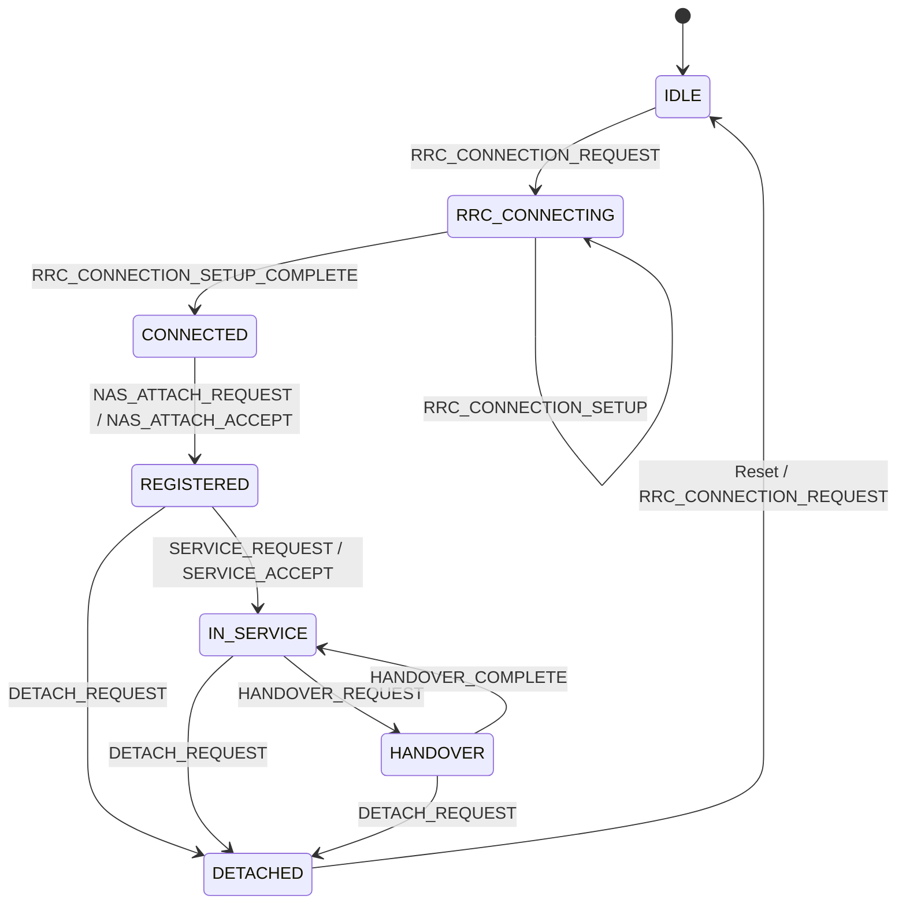

# LTE/5G Protocol Stack & State Machine Specification

This document defines the supported protocol layers, signaling messages, finite state machine (FSM) transitions, and anomaly detection rules in **QualTest v1.0**.

---

## Supported Protocol Layers & Messages

QualTest models high-level 3GPP LTE and 5G NR control plane signaling:

| Protocol Layer | Message Enum | Description | Direction |
| :--- | :--- | :--- | :--- |
| **RRC** | `RRC_CONNECTION_REQUEST` | Initial RRC connection request from UE to eNB/gNB | OUTGOING |
| **RRC** | `RRC_CONNECTION_SETUP` | Network RRC connection setup response | INCOMING |
| **RRC** | `RRC_CONNECTION_SETUP_COMPLETE` | UE RRC setup complete acknowledgment | OUTGOING |
| **NAS** | `NAS_ATTACH_REQUEST` | UE network attach request | OUTGOING |
| **NAS** | `NAS_ATTACH_ACCEPT` | Core network attach accept response | INCOMING |
| **NAS** | `NAS_AUTH_REQUEST` | Network authentication request challenge | INCOMING |
| **NAS** | `NAS_AUTH_ACCEPT` | UE authentication response | OUTGOING |
| **MOBILITY** | `SERVICE_REQUEST` | UE service request for bearer activation | OUTGOING |
| **MOBILITY** | `SERVICE_ACCEPT` | Network service accept response | INCOMING |
| **MOBILITY** | `HANDOVER_REQUEST` | Network handover command to target cell | INCOMING |
| **MOBILITY** | `HANDOVER_COMPLETE` | UE handover complete notification | OUTGOING |
| **DETACH** | `DETACH_REQUEST` | UE or Network detach request | EITHER |
| **DETACH** | `DETACH_ACCEPT` | Detach complete acknowledgment | EITHER |

---

## Modem Finite State Machine (`ModemFSM`)

The `ModemFSM` class reconstructs modem protocol state based on incoming and outgoing signaling events:

```
                      +-------------------+
                      |       IDLE        |
                      +-------------------+
                                |
                                | RRC_CONNECTION_REQUEST
                                v
                      +-------------------+
                      |  RRC_CONNECTING   |
                      +-------------------+
                                |
                                | RRC_CONNECTION_SETUP_COMPLETE
                                v
                      +-------------------+
                      |     CONNECTED     |
                      +-------------------+
                                |
                                | NAS_ATTACH_ACCEPT
                                v
                      +-------------------+
                      |    REGISTERED     |
                      +-------------------+
                                |
                                | SERVICE_ACCEPT / REQUEST
                                v
                      +-------------------+
                      |    IN_SERVICE     |
                      +-------------------+
                             /     \
    HANDOVER_REQUEST        /       \       DETACH_REQUEST
                           v         v
                   +----------+   +----------+
                   | HANDOVER |   | DETACHED |
                   +----------+   +----------+
                         |
       HANDOVER_COMPLETE |
                         v
                   +----------+
                   |IN_SERVICE|
                   +----------+
```

---

## Mermaid FSM State Diagram



---

## Signaling Anomaly Detection Rules

The `ProtocolAnalyzer` flags protocol issues during offline log replay:

| Anomaly Type | Trigger Condition |
| :--- | :--- |
| **`MISSING_MESSAGE`** | Expected precedent message missing (e.g. `NAS_ATTACH_ACCEPT` without `NAS_ATTACH_REQUEST`). |
| **`DUPLICATE_MESSAGE`** | Consecutive duplicate request message without state transition. |
| **`INVALID_TRANSITION`** | Message received in an invalid FSM state (e.g. `HANDOVER_COMPLETE` while `IDLE`). |
| **`UNEXPECTED_DETACH`** | `DETACH_REQUEST` received while in `IDLE` or `RRC_CONNECTING` state. |
| **`AUTHENTICATION_FAILURE`** | `NAS_ATTACH_ACCEPT` reached after `NAS_AUTH_REQUEST` without `NAS_AUTH_ACCEPT`. |
| **`UNKNOWN_MESSAGE`** | Unrecognized protocol message string encountered in stream. |
